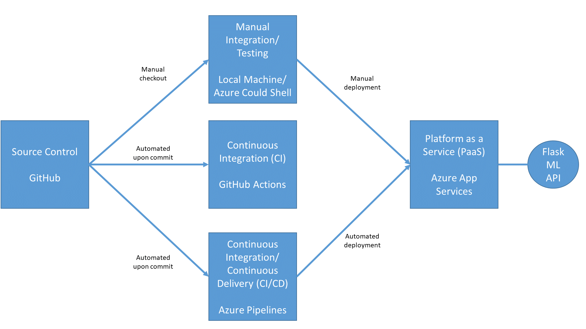

[](https://github.com/Spreeha/Building-a-CI-CD-Pipeline/actions/workflows/main.yml)

# Overview
This project demoes building CI/CD pipelines with .
A Machine Learning web application is built, test, and deployed using Github Actions and Azure pipelines.

[Demo Video](https://youtu.be/Wl0BEl4KI9k)

## Project Plan


Trello board - 
The [yearly project plan](https://github.com/Spreeha/Building-a-CI-CD-Pipeline/blob/main/projectplan/project%20plan%202023.xlsx) shows how important automation is in the project plan.

The [quarterly project plan](https://github.com/Spreeha/Building-a-CI-CD-Pipeline/blob/main/projectplan/project%20plan%20Q2.xlsx) shows the steps for building the CI-CD pipeline and other estimate details

The [Trello board](https://trello.com/invite/b/kSTHkrAB/ATTId5d4bb3bc2c703a5e22446ac9c7819129517387B/agile-board-template-trello) is then used for task planning and tracking.

## Instructions

  


* Project running on Azure App Service
Install the app to Azure app services using the free tier:
```bash
(.testapp98) azureuser@Azure:~/testapp98$ az webapp up -n flask-sklearn --sku F1
```


Edit file 'make_predict_azure_app.sh' and replace '< yourappname >' with your webapp name (e.g. testapp98).

Test the webapp locally or on Azure Cloud Shell:
```bash
(.testapp98) azureuser@Azure:~/testapp98$ ./make_predict_azure_app.sh
```


Logs of your running webapp can be accessed via cloud shell as a stream:
```bash
(.testapp98) azureuser@Azure:~/testapp98$ az webapp log tail
```


Performance validation of the webapp can be performed via a load test using [locust](https://locust.io).
Replace '< yourappname >' in the provided configuration and call locust:
```bash
(.testapp98) azureuser@Azure:~/testapp98$ nano locustfile.py
(.testapp98) azureuser@Azure:~/testapp98$ locust -f locustfile.py --headless -u 20 -r 5 -t 20s
```


* Passing tests that are displayed after running the `make all` command from the `Makefile`
  


* Output of a test run
  


* Successful deploy of the project in Azure Pipelines.  [Note the official documentation should be referred to and double checked as you setup CI/CD](https://docs.microsoft.com/en-us/azure/devops/pipelines/ecosystems/python-webapp?view=azure-devops).


* Running Azure App Service from Azure Pipelines automatic deployment


* GitHub Actions build
  


>

## Demo 

[Demo Video](https://youtu.be/Wl0BEl4KI9k)


